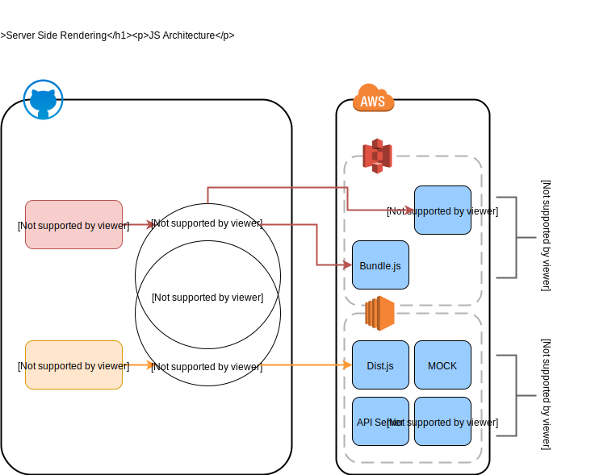
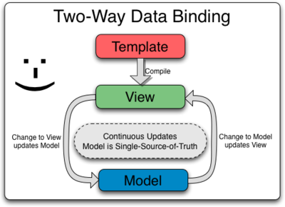

## Outline

1. About Me

2. Three Months Works

	1. Some Independent Components
		
	2. Introduction for current project
		
	3. Coop with Designer

3. Future Works

---

### About Me

---

### 完成的獨立ＵＩ元件

Notes:

> React本身是非常適合做模組化的工具，因此為了讓元件能夠共用以及低耦合，一開始便朝向獨立UI元件的方向著手進行，在三個月的期間中，因應模組化而發展出了兩個可複用的UI獨立元件，目前還正在能對Style客製化調整的彈性

-

### Draft-COMPONENT

應用FB於*React Conf 2016*推出的圖文編輯架構

<iframe data-src="./draft.html" style="width: 95%; height: 500px;"/>

Notes:

> 跟一般使用的Html content-editable不同，藉由框架本身維護一中繼state來做圖文編輯，兼有彈性以及安全性

-

### Crop-Component

提供介面負責處理圖片的上傳、裁切

<iframe data-src="./crop.html" style="width: 95%; height: 500px;"/>

Notes:

> 公司目前的共用ＡＰＩ提供圖片的上傳與裁切，但若同時能有一個共用的上傳ＵＩ就更好了

-

### 目前的專案

Notes:

> 以下介紹目前投入的案子，架構本身採用React + Node + Java Stack, 架設在AWS上並且使用其許多服務
> 使用*Nodejs*的原因，ＳＰＡ和古早的網頁程式各有所長，除了必然的開發難度較高外，藉由SSR的使用可解決大部分ＳＰＡ的問題

-

Notes: 

> 目前進行的架構

-

### Why So Complicated?

-

### For User

- **Don't make me think**
	
	最好的ＵＸ應該讓使用者感覺不到。藉由ＵＩ的高度模組化，提供全產品相似的瀏覽體驗，減少介面摸索時間 <!--React-->

- **Don't make me wait**

	RCP like Experience <!--React-->
	
	TTFB、Better SEO support <!--SSR-->

Notes:

> 幾乎感覺不到換頁的時間與閃爍，與RCP的體驗相似，
> TTFB(Time To First Byte)，將進入後的加載時間縮至最小
> SEO Support，使用者能更快搜尋到想要的內容
> 註：後兩者是採用ＳＳＲ才有的價值

-

### For Developer

- **Clean Code**

	1. 封裝與重用性 <!--DRY-->
	2. Best Practice多，與成熟度高的社群互助 <!--Upon the Shoulders of Giants-->

- **Easy to debug**

	1. 與顯示有關的邏輯不會分散在前後端 (Single stack)
	2. 真相只有一個 (One way binding)
	
<!-- .element: class="fragment fade-up" -->
<!-- .element: class="fragment fade-up" -->
	
Notes:	

> 1. Reuse and Encapsulation.
Composeable - 將複雜的ＵＩ解構成多個功能獨立且簡單的組件
Reusable - 同個組件可以用在多個ui頁面，保持一致性
Maintainable - 功能簡單且單一的組件能更好地被理解與閱讀
> 2. Standing upon the shoulders of giants. 與社群相輔相成
社群成熟度高，很多組件都可以從開源社群中學習

> 1. Single stack (Learn once, code everywhere)
省去邏輯分布在前後端的溝通成本
前後端多少還是會各自埋頭硬解一樣的錯誤，一樣的問題可能在後端已經處理過但前端不知道，反之亦然
> 2. One way binding (Single Source of Truth)

-

### 與設計的合作

- 問題
	
	切版缺乏模組化思考
				
- 解決

	1. Adopt VCS
	2. Adpot Storybook

Notes:

> [問題]html使用了過多語意標籤、較深的css樣式選擇器，降低了可複用性
導致套用設計版時，部分代碼不能重用甚至必須刪除，兩者不同步、有不少重工
> [解決一]由於切版和react component兩者不一致，更版時很難對齊，
故使用簡單的ＧＵＩ輔助版控，repo放在Q槽
> [解決二]採用活著且可操作的文件檔(與code同步更新)，清楚呈現哪些部分被設計成組件，減少溝通阻礙

-

### React Storybook

<iframe data-src="http://buddy-mock-43560694.ap-northeast-1.elb.amazonaws.com:9001" style="width: 95%; height: 500px;"/>

---

## Future

Notes:

> JavaScript has overwhlming advantage on developing all application with UI. With Virtual DOM, we can easily developing desktop even mobile application.

-

### More Devices

~~Write Once, Run Everywhere~~

Learn Once, Write Anywhere<!-- .element: class="fragment fade-up" -->

Notes:

> React Native is a framework which used to develop cross platform mobile app. But what is the advantage using javascript over native? 

-

### Ease Server Loading

一個問題的解決通常會伴生另一個問題... Loading

Notes:

> React本來主要是設計給客戶端使用，它其實未針對Server Side的使用做過太多的最佳化，這會帶來一些問題
> 針對每一個用戶的請求，Server端總是要渲染整個頁面，即使頁面只有發生些微的改動，因此我們需要模擬template的機制，將不會變化的部分快取起來，只重新渲染會變化的部分
> 由於這部分需要對React的原始碼有更多的了解，也在等待ＳＳＲ更成熟後是否會有完整的解決方案，因此目前沒有著手進行這個部分